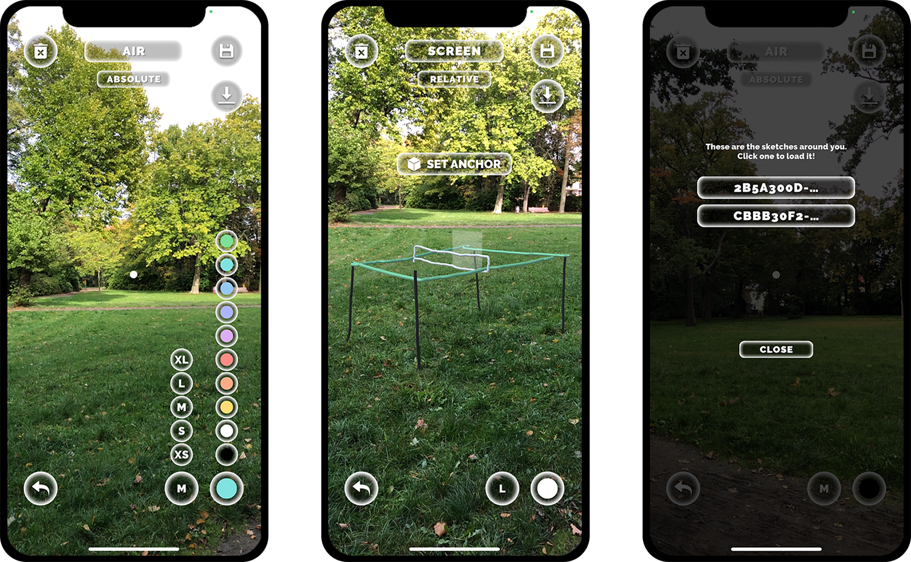

# AsketchR Prototype

Mobile AR App for creating drawings in 3D space. Create drawings using multiple different interaction methods. 
Your creations can be persistently anchored in the real world and reloaded at any time by creating Cloud Anchors with Azure Spatial Anchors.

Tested with iOS only.

## Examples

## Install

Additional plugins:

- VRSketchingGeometry (see repo [here](https://github.com/tterpi/VRSketchingGeometry))

Unity packages:

- com.microsoft.azure.spatial-anchors-sdk.core-2.12.0
- com.microsoft.azure.spatial-anchors-sdk.ios-2.12.0
